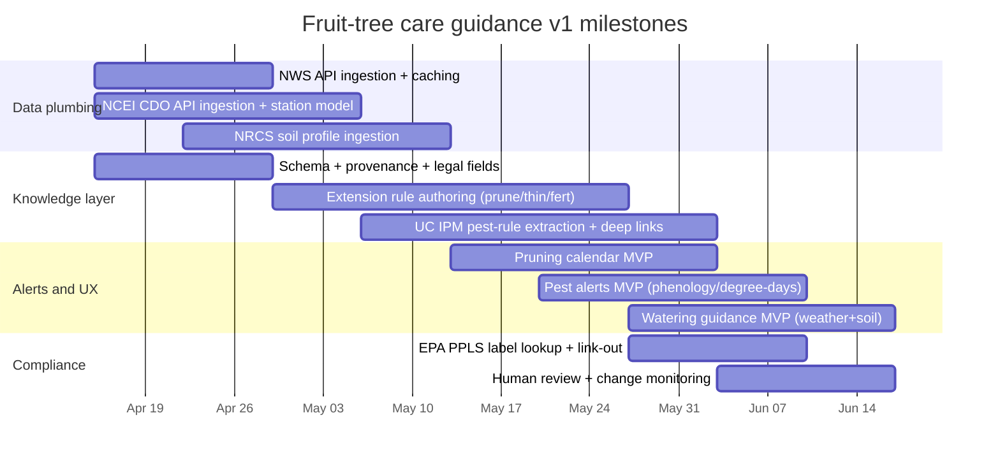

# Research-Backed Fruit-Tree Care in the U.S. Using Authoritative, Automatable Sources

## Executive summary

This report evaluates a consensus “top 10” stack of U.S.-focused sources (the same set previously agreed) for building a backyard fruit-tree care app or knowledge system that is both **research-backed** (horticulture + IPM guidance) and **operationally reliable** (APIs, machine-readable datasets, update cadence, and clear reuse permissions). The key finding is that **no single source covers pruning, thinning, fertilizing, watering, and pests end-to-end**. The most dependable approach is a **two-layer architecture**: (1) **curated, research-based care rules** from land‑grant Extension and IPM programs, and (2) **live environmental + regulatory data** from government or explicitly licensed APIs that personalize *when* rules apply (weather, degree-days, soils, phenology, evapotranspiration, pesticide labels). citeturn15view3turn24search3turn4view0turn12view0

From a “legitimate data + legitimate access” standpoint, the strongest automation posture comes from sources with explicit, stable programmatic interfaces and clear licensing: **National Weather Service API** (public domain with constraints on implying endorsement), **USDA NRCS Soil Data Access**, **NOAA/NCEI Climate Data Online API**, **USA‑NPN** (CC BY 4.0), **USPEST.ORG** (CC BY 4.0), and **EPA PPLS API** (12-hour refresh), plus irrigation/ET services (CIMIS and OpenET) that require keys and have additional terms. citeturn4view0turn14search2turn16view0turn3view1turn8view4turn11view0turn12view0turn13search6turn20view0

Legally, the most important constraint is that **university/Extension and UC IPM text/media are often copyrighted and may restrict redistribution**, especially commercial reuse; in those cases, a robust strategy is to store **normalized “rules” you authored** (your own expression), keep **tight provenance + citations**, and either (a) deep-link to the original content, or (b) negotiate permissions/partnerships when you need to reproduce substantial text/images. citeturn24search3turn15view0turn24search0

This report focuses on the entity["country","United States","country"] context (English-only), and uses primary/official documentation for APIs, licensing, and update cadence wherever available. citeturn6search0turn14search2

## Ranked shortlist of the top U.S. resources with canonical URLs

The ranking below weights: (a) **authority for fruit-tree care**, (b) **coverage of your target tasks** (pruning, thinning, fertilizing, watering, pests), (c) **programmatic accessibility**, and (d) **reuse clarity**.

1) Land‑grant Extension fruit-tree programs and publications directory  
Canonical entry points: `https://www.nifa.usda.gov/grants/land-grant-university-website-directory` citeturn15view3  
Supplemental expert-routing entry point: `https://ask.extension.org/` citeturn24search29

Land‑grant Extension resources are the most consistently **research-backed and locally valid** guidance source for backyard fruit trees because they translate region-specific horticulture research into public recommendations through the Cooperative Extension system. For pruning, thinning, fertilizing, watering, and pest IPM, this is usually the layer that best captures local cultivar norms, phenology timing, and common pest pressure by state/region. citeturn15view3turn14search4

**Content types & reuse:** Content types vary by institution (HTML articles, PDFs, class handouts, checklists, sometimes decision aids). Reuse terms also vary: some Extension content is released under Creative Commons variants (often noncommercial/share-alike constraints), while other material is fully copyrighted by the university. You should treat reuse as **institution-by-institution and page-by-page** unless a clear license is stated. citeturn24search1turn24search0

**Recommended extraction strategy:** Prioritize **manual curation + normalized rule authoring** (extract “what to do” into your own schema, cite the Extension URL, store only minimal quotations if needed). For scale, negotiate partnerships with high-value states/programs and request bulk metadata feeds where possible. Avoid indiscriminate scraping, because licensing is heterogeneous and sometimes restrictive. (Rate limits/update cadence: unspecified system-wide; each site differs.) citeturn24search0

2) entity["organization","University of California Statewide Integrated Pest Management Program","ipm program"]  
Canonical URL: `https://ipm.ucanr.edu/` citeturn0search18

This is one of the most authoritative, practitioner-facing IPM sources in the U.S., especially strong for **pest identification, monitoring, thresholds, and management options**. For an app, it can anchor the “pests” domain and provide rigor for decision support (what to scout, when risk is rising, and how to respond). citeturn0search18

**Content types & reuse:** The site includes extensive pest management guidance, images/figures, and supporting materials. Reuse is specifically constrained: UC IPM’s legal notices state that (outside specified allowances) textual materials may not be copied/distributed without prior written agreement and that commercial distribution is prohibited; UC IPM explicitly prefers deep-linking for web display and requires permission for broader reuse. citeturn24search3

**Recommended extraction strategy:** For a v1, do **citation-first rule extraction**: store your own structured guidance records (e.g., “codling moth: monitor degree-days; inspect traps; follow local thresholds”) and deep-link to UC IPM pages for full details. If you need to embed images or substantial text, pursue a **permission and licensing pathway** early. (Update cadence: not published globally; treat as irregular; monitor page changes via periodic checks.) citeturn24search3

3) entity["organization","National Weather Service","us weather agency"] API  
Canonical URL: `https://weather-gov.github.io/api/` citeturn1search16

For backyard fruit trees, the highest-impact “live personalization” variables are short-range weather hazards: freezes, heat, wind, precipitation, and humidity windows that influence irrigation timing, pruning safety, spray windows, and disease pressure. The NWS API is a stable, public data backbone for those triggers. citeturn4view0turn1search16

**Content types & reuse:** The API returns JSON and is designed to provide current data with HTTP caching headers (Cache-Control, Last-Modified). It requires a proper User-Agent (ideally with contact email) and discourages cache-busting. Separately, NWS states information on its web pages is public domain unless noted, with restrictions (don’t claim authorship, don’t imply endorsement/affiliation, don’t modify and present as official). citeturn4view0turn14search2

**Recommended extraction strategy:** Use **API ingestion** (not scraping) with strict cache compliance: store forecast/hazard responses with ETag/Last-Modified, respect Cache-Control, and include a consistent User-Agent. Store canonical location identifiers (gridpoint office + grid X/Y) returned by `/points/{lat},{lon}` so repeated queries are efficient. (Rate limits: not explicitly stated in the docs cited; treat as shared public infrastructure and throttle aggressively.) citeturn4view0turn14search2

4) entity["organization","Natural Resources Conservation Service","usda agency"] Soil Data Access and SSURGO  
Canonical URL: `https://sdmdataaccess.nrcs.usda.gov/` citeturn3view2  
Web service documentation: `https://sdmdataaccess.sc.egov.usda.gov/WebServiceHelp.aspx` citeturn16view0

Soil governs watering and nutrient dynamics. SSURGO-derived properties (e.g., available water capacity, drainage class, texture) are extremely useful for turning generic watering/fertilizing advice into region- and site-appropriate guidance. citeturn16view2turn3view2

**Content types & reuse:** Soil Data Access provides multiple machine interfaces: SOAP tabular service, REST/POST endpoints for SQL queries, and OGC WMS/WFS services. NRCS also publishes recommended citation formats (critical for provenance and defensible guidance). citeturn16view0turn5view0turn16view2

**Recommended extraction strategy:** Use **API ingestion** (SQL via `post.rest`) rather than scraping. Capture canonical identifiers like `mukey` (map unit key) + component keys, plus the SSURGO version/date and your “accessed” date. Build a soil-derived “watering capacity profile” (bucket size proxy) used downstream by watering rules. (Rate limits/update cadence: unspecified in the public docs cited; implement client-side throttling and caching.) citeturn16view0turn5view0

5) entity["organization","National Centers for Environmental Information","noaa data center"] Climate Data Online API and U.S. Climate Normals  
Canonical URLs:  
- API docs: `https://www.ncei.noaa.gov/support/access-data-service-api-user-documentation` citeturn3view1  
- Normals dataset overview: `https://www.ncei.noaa.gov/products/land-based-station/us-climate-normals` citeturn1search1

This is the best “climate context” layer for orchard planning: typical temperature/precip patterns, frost risk context, and long-term baselines that help your system know what “normal” looks like for a location and season. Climate Normals are explicitly updated on a decadal cadence, making them stable reference data. citeturn1search25turn3view1

**Content types & reuse:** NCEI offers free access to large climate archives (via web and API). Climate Data Online’s API uses a token and publishes request limits (5 requests/second and 10,000 requests/day per token). NCEI also states its data presented through certain interfaces is in the public domain; in addition, U.S. Government works are generally not subject to copyright under 17 U.S.C. § 105 (with important caveats around third-party content). citeturn3view1turn23search1turn6search0turn23search15

**Recommended extraction strategy:** Use **API ingestion** with a dedicated token, caching, and a “station selection” strategy (e.g., nearest high-quality stations, elevation screening). Capture stable identifiers: station IDs, dataset IDs, datatype IDs, and the date range queried. For normals, treat as versioned reference tables and refresh on published decade updates (next update timing unspecified in source docs beyond the 10-year update pattern). citeturn3view1turn1search25

6) Plant Hardiness Zone Map and PRISM datasets  
Canonical URLs:  
- Map: `https://planthardiness.ars.usda.gov/` citeturn7search13  
- Data + terms: `https://prism.oregonstate.edu/phzm/` citeturn8view1

The hardiness zone is not sufficient to run an orchard calendar, but it is still a high-value “first-pass” regionalization feature for cold tolerance and winter injury risk—useful as a baseline stratifier for pruning timing rules, variety selection modules, and overwintering risk notes. citeturn7search13turn7search5

**Content types & reuse:** Under a cooperative agreement, the underlying GIS datasets are owned by the contributing group and are reproducible/redistributable with conditions (logo display and explicit disclaimer requirements if altered). Separate PRISM terms allow reproduction/distribution of data but also assert copyright/ownership and require prominent source attribution with access date. citeturn8view1turn8view0turn7search5

**Recommended extraction strategy:** Prefer consuming the official published zone value (or ZIP-based listing where available) as a **derived attribute** in your system. If you redistribute maps or derived GIS, implement the required attribution/logo/disclaimer conditions as part of your rendering pipeline. Store dataset lineage: map version (e.g., 2023), PRISM access date, and any transformation notes. (Update cadence is not fixed; historically major map releases are separated by years; no official schedule stated.) citeturn8view1turn7search5

7) entity["organization","USA National Phenology Network","phenology database"]  
Canonical URL: `https://www.usanpn.org/data/code` citeturn17view0

Phenology is the most “biologically correct” timing axis for pruning/thinning/pest pressure in many contexts. This source is uniquely valuable because it provides both observational data and gridded model products, plus repeatable data access methods that can drive phenology-stage estimation in your app. citeturn19search1turn17view0

**Content types & reuse:** USA‑NPN provides programmatic access pathways (observational and geospatial APIs, tools/libraries). Its Terms of Use include a Data Use Policy stating that National Phenology Database data are available under **CC BY 4.0**, with explicit attribution requirements. Geospatial services are exposed via OGC services and documented; the geoserver documentation page claims it is updated automatically every 5 minutes. citeturn8view4turn18view1turn17view0

**Recommended extraction strategy:** Use **API ingestion + geoserver consumption** (WMS/WCS) depending on your needs: WMS for map tiles/visual layers and WCS/NetCDF/GeoTIFF when you need underlying rasters. Capture canonical layer identifiers (workspace:layer), time parameters, spatial bounds, and license/attribution strings. Implement server-friendly throttling; rate limits are not formalized in the cited docs. citeturn18view1turn8view4

8) entity["organization","USPEST.ORG","degree-day models"] degree-day and disease-risk modeling  
Canonical URL: `https://uspest.org/wea/` citeturn9view0

For pests and some diseases, degree-days and weather-driven risk models are among the most practical ways to generate “what to do this week” alerts (monitoring windows, emergence predictions, infection risk periods). This source explicitly targets agricultural decision support at scale across the U.S. citeturn9view0turn9view2

**Content types & reuse:** The site provides model interfaces, maps, tutorials, push notifications, and mentions API documentation “available by request to legitimate users.” Its Terms of Use PDF states that data and map products are available under **CC BY 4.0** with attribution and that content is provided “as is.” citeturn11view0turn9view0turn9view1

**Recommended extraction strategy:** Treat as **API/partnership ingestion**: request the API documentation, agree on appropriate uses, and integrate model outputs as event predictions (e.g., degree-day accumulations vs thresholds). Capture canonical identifiers like model name/version, base temperature thresholds, biofix definition, weather source lineage, and “created” dates for outputs. Monitor operational notices: the project has explicitly disabled tools at times due to abusive traffic, so resiliency and respectful access patterns matter. citeturn9view1turn11view0

9) entity["organization","United States Environmental Protection Agency","us federal agency"] Pesticide Product Label System API  
Canonical URL: `https://www.epa.gov/pesticide-labels/pesticide-product-label-system-ppls-application-program-interface-api` citeturn12view0

For “pests” workflows that mention pesticides at all, legitimacy hinges on the label. This resource provides official access to pesticide label metadata and label PDFs, enabling your system to verify registration numbers, retrieve the current label, and keep “label is the law” compliance visible. citeturn13search0turn12view0

**Content types & reuse:** The PPLS API is RESTful with JSON output and the underlying database is updated every 12 hours. PPLS also provides direct URLs to text-searchable label PDFs and product transfer history. EPA’s data license pages emphasize that EPA-produced data are generally public domain by default unless specified; EPA also cautions that some referenced materials may be copyrighted and require permission from the copyright owner. citeturn12view0turn12view1turn12view2turn12view3

**Recommended extraction strategy:** Use **API ingestion** for metadata + **link-out** for PDFs (avoid redistributing full label PDFs unless you have a clear legal basis). Store canonical keys: EPA Registration Number, stamped date, company/product IDs, and the label URL pattern; re-check labels on at least a 12-hour cadence if you are surfacing compliance-critical information. Add strong UI disclaimers: labels are legally enforceable and include the federal-law misuse statement. citeturn12view0turn13search0

10) entity["organization","California Department of Water Resources","state water agency, ca"] CIMIS Web API and entity["organization","OpenET","nonprofit et data"] API  
Canonical URLs:  
- CIMIS Web API: `https://et.water.ca.gov/` citeturn3view3  
- OpenET API: `https://etdata.org/api/` citeturn8view3

These are specialized but high-value for watering: CIMIS provides station-based and spatial reference ET and weather data (California-focused), while OpenET provides satellite-based ET across the U.S., useful for irrigation intelligence and water-demand estimation where appropriate. citeturn3view3turn20view1turn8view3

**Content types & reuse:** CIMIS provides RESTful services delivering JSON or XML and requires an application key for weather data services; California open-data catalog entries for CIMIS indicate “license not specified,” and DWR’s site provides general conditions of use/disclaimers rather than an explicit data license. OpenET requires API keys tied to quotas; its public documentation includes authentication approach and notes that recent data may be updated for up to six months. OpenET’s site terms also apply. citeturn13search6turn21search27turn22view0turn20view0turn20view1turn8view2

**Recommended extraction strategy:** Use **API ingestion** for both, with strict key handling and quotas. For CIMIS, treat legal reuse as **unspecified** until you confirm an explicit license; store minimal derived outputs (ETo summaries) and provide attribution. For OpenET, store ET time series as versioned facts and re-fetch data within the documented correction window; capture model name (e.g., “Ensemble”), variable, reference ET source, geometry type, and “last retrieved.” citeturn20view0turn20view1turn21search27turn22view0

## Comparative table of content types, reuse posture, and ingestion approach

| Resource | Content types | License / API available | Recommended ingestion method | Update cadence |
|---|---|---|---|---|
| Land-grant Extension fruit programs | Articles, PDFs, guides; sometimes tools; local calendars | License varies by institution; not uniformly open citeturn24search1turn24search0 | Manual curation → normalized rules; partner/licensing for scale | Unspecified (varies) |
| UC IPM | IPM guidelines, images/figures, web pages | Reuse restricted; commercial distribution prohibited; deep-linking preferred citeturn24search3 | Manual extraction + deep links; permission/partnership for embedding | Unspecified (monitor changes) |
| NWS API | JSON forecasts, alerts; caching headers | Public domain with constraints; User-Agent required citeturn14search2turn4view0 | API ingestion with caching + throttling | “Current data” via API; cadence not numerically specified citeturn4view0 |
| NRCS Soil Data Access / SSURGO | SOAP/REST tabular; WMS/WFS spatial; docs | Web services published; citation guidance available citeturn16view0turn5view0 | API ingestion (SQL/post.rest) + caching | Unspecified in docs |
| NCEI CDO API + Climate Normals | API datasets + station metadata; normals | Tokened API with explicit limits (5 r/s, 10k/day); normals updated every 10 years citeturn3view1turn1search25 | API ingestion + reference-table versioning | Normals: decadal citeturn1search25 |
| Plant Hardiness + PRISM | Interactive map; grid/shapefile/ZIP listings | Repro/redistribute with conditions; PRISM requires attribution and asserts ownership citeturn8view1turn8view0 | Reference lookup (zone) + compliant attribution | Major releases irregular; schedule unspecified citeturn7search5 |
| USA-NPN | Observational + geospatial APIs; OGC services | CC BY 4.0; geoserver described as auto-updating every 5 minutes citeturn8view4turn18view1 | API ingestion + WMS/WCS for rasters | Geoserver doc: ~5 min citeturn18view1 |
| USPEST.ORG | Degree-day models, risk models, maps; API by request | CC BY 4.0; API docs by request citeturn11view0turn9view0 | Partnership/API ingestion; cache outputs | Weather inputs “usually with 15 minute updates” (project statement); model cadence varies citeturn9view2 |
| EPA PPLS API | REST API JSON; label PDFs | API; database updated every 12 hours; EPA data generally public domain (with third-party caveats) citeturn12view0turn12view2turn12view3 | API ingestion for metadata; link-out to PDFs | 12 hours citeturn12view0 |
| CIMIS + OpenET | REST APIs; JSON/XML; ET time series | CIMIS license unspecified in catalog; OpenET uses API keys/quotas and has site terms citeturn21search27turn20view0turn8view2 | API ingestion with keys/quotas; store derived ET metrics | OpenET: recent data may update up to ~6 months citeturn20view1 |

## Minimal normalized schema for a fruit-tree care knowledge layer

A practical “knowledge layer” schema needs to represent: **who** (species/cultivar group), **where** (region + site context), **when** (phenology + time windows + weather thresholds), **what to do** (action), **why** (goal/rationale), **how sure** (confidence), and **where it came from** (provenance + legal). The schema below is intentionally minimal but normalized so you can add data sources without rewriting the model.

Proposed logical entities (implementation-agnostic):

- **Species**: stable taxon identifiers + common names (you can add external taxonomies later).  
- **Region**: minimal set: state/ZIP, hardiness zone, optional climate station IDs, optional soil map-unit keys.  
- **Phenology stage**: controlled vocabulary (e.g., dormant, bud swell, bloom, petal fall, fruit set, sizing, pre-harvest, post-harvest).  
- **Action rule**: a single “do X when Y” rule with thresholds, contraindications, and references.  
- **Source provenance**: canonical URL, publisher/org, retrieval date, license notes, and any constraints.  
- **Observation triggers**: optional, to connect rules to live data (forecast freeze, degree-days, ETo anomaly, etc.).

A minimal JSON-like record shape for **ActionRule**:

```json
{
  "rule_id": "string (stable)",
  "action_type": "prune | thin | fertilize | water | scout | treat",
  "species": {
    "common_name": "string",
    "scientific_name": "string (optional)",
    "group": "pome | stone | citrus | etc (optional)"
  },
  "region_context": {
    "zip": "string (optional)",
    "hardiness_zone": "string (optional)",
    "state": "string (optional)"
  },
  "phenology_stage": "controlled_string",
  "timing_rules": [
    {
      "type": "calendar | phenology | degree_day | weather | soil",
      "condition": "machine-readable expression",
      "thresholds": [{"name": "string", "op": ">=|<=|...", "value": 0, "unit": "string"}]
    }
  ],
  "instructions": {
    "summary": "string (your authored guidance)",
    "steps": ["string (optional)"],
    "contraindications": ["string (optional)"]
  },
  "confidence": {
    "score": 0.0,
    "basis": "expert_guidance | observational_model | regulatory | mixed"
  },
  "provenance": [
    {
      "source_name": "string",
      "canonical_url": "string",
      "retrieved_at": "YYYY-MM-DD",
      "publisher": "string",
      "license_or_terms": "string",
      "reuse_notes": "string"
    }
  ],
  "last_reviewed_at": "YYYY-MM-DD",
  "legal_notes": {
    "liability_category": "pesticide | general_horticulture",
    "required_disclaimers": ["string"]
  }
}
```

Sample metadata JSON for one pruning rule (illustrative)

This example shows how you would represent a timing rule in a way that can be personalized by location and season, while keeping explicit provenance. The biological recommendation used here is a common Extension pattern: dormant pruning timing should be late winter where winter injury risk is a concern. citeturn25search27

```json
{
  "rule_id": "prune.pome.dormant.late_winter.v1",
  "action_type": "prune",
  "species": {
    "common_name": "apple (pome fruit)",
    "scientific_name": "Malus domestica",
    "group": "pome"
  },
  "region_context": {
    "state": "US",
    "hardiness_zone": "unspecified",
    "zip": "unspecified"
  },
  "phenology_stage": "dormant",
  "timing_rules": [
    {
      "type": "calendar",
      "condition": "late_winter_window",
      "thresholds": []
    },
    {
      "type": "weather",
      "condition": "avoid_high_winter_injury_risk",
      "thresholds": [
        {"name": "min_temp_next_72h", "op": "<=", "value": 15, "unit": "F", "note": "example threshold; tune per region"}
      ]
    }
  ],
  "instructions": {
    "summary": "Prefer dormant pruning late in winter to reduce winter injury risk; adjust timing by local conditions and species.",
    "contraindications": [
      "If severe cold is forecast, delay pruning (site-specific)."
    ]
  },
  "confidence": {
    "score": 0.75,
    "basis": "expert_guidance"
  },
  "provenance": [
    {
      "source_name": "Land-grant Extension publication",
      "canonical_url": "https://content.ces.ncsu.edu/pdf/training-and-pruning-fruit-trees/2014-09-29/training-and-pruning-fruit-trees-in-north-carolina.pdf",
      "retrieved_at": "2026-04-13",
      "publisher": "North Carolina State Extension (via NCSU)",
      "license_or_terms": "unspecified",
      "reuse_notes": "Store paraphrased rule + citation; avoid reproducing large excerpts unless licensed."
    }
  ],
  "last_reviewed_at": "2026-04-13",
  "legal_notes": {
    "liability_category": "general_horticulture",
    "required_disclaimers": [
      "Local conditions and cultivar practices vary; consult local Extension guidance."
    ]
  }
}
```

## Workflow to keep guidance current

A durable “currentness” workflow should distinguish between **(a) rule text** (slow-changing horticultural expertise) and **(b) live triggers** (fast-changing weather, pest emergence, label updates). The workflow below is designed to be auditable and low-risk.

For high-velocity APIs, run scheduled ingestion keyed to the provider’s stated refresh behavior. Examples:
- PPLS: re-query on a 12-hour cadence because EPA states the database is updated every 12 hours. citeturn12view0  
- USA-NPN geoserver products: treat as near-real-time if you use those layers; the geoserver documentation claims updates every 5 minutes. citeturn18view1  
- OpenET: treat the “recent window” as mutable because documentation states recent data may be updated for up to about six months; implement periodic backfills/diffing for the last ~180 days of ET values you display. citeturn20view1  
- NWS API: use HTTP caching correctly (Cache-Control, Last-Modified) and do not cache-bust; this gives you freshness while minimizing load and throttling risk. citeturn4view0  

For slower-changing reference layers (soil, normals, hardiness zones), use versioned refresh cycles:
- Climate Normals: refresh on decade releases (NCEI describes normals as updated every 10 years). citeturn1search25  
- Soil and map layers: monitor for upstream revisions but avoid frequent full refresh unless you are seeing explicit updates; capture “accessed at” timestamps and keep deterministic queries reproducible. citeturn5view0  

For copyrighted, narrative guidance sources (Extension + UC IPM), avoid “silent drift”:
- Store a **source snapshot hash** (e.g., HTML hash or PDF checksum) and a **last-checked** date for each cited page.
- Re-check on a reasonable cadence (e.g., monthly/quarterly depending on how often your team sees changes).
- Trigger human review when (1) hash changes, (2) the page returns a redirect/404, (3) the title or publication date changes, or (4) a high-impact rule would change downstream behavior (e.g., pesticide safety language). (These triggers are implementation design choices; providers do not generally publish formal changefeeds for narrative text.) citeturn24search3turn15view0

## Legal and ethical considerations

Copyright and licensing boundaries must be treated as first-class metadata, not an afterthought. U.S. federal content is often public domain domestically (17 U.S.C. § 105), but this does **not** automatically apply to state governments, universities, or mixed/third‑party materials. USA.gov explicitly notes that state/local government materials may be protected by copyright. citeturn6search0turn24search0

For university/Extension and UC materials, you need a conservative approach:
- UC IPM explicitly restricts copying/transmission of textual materials (except narrow allowed uses) and prohibits commercial distribution without prior written agreement; therefore, “scrape and republish” is a legal and partnership risk. citeturn24search3  
- UC ANR’s copyright page indicates its materials are licensed for educational purposes under CC BY‑NC‑ND 4.0 with additional restrictions (e.g., photos not for commercial promotion), reinforcing that you must track license terms at the source level. citeturn15view0  
- For Extension across states, licensing is heterogeneous; some programs explicitly use CC licenses (often with noncommercial/share-alike constraints). citeturn24search1  

Pesticides create an elevated duty of care. EPA states pesticide labels are legally enforceable and include the federal-law misuse statement (“the label is the law”). If your product provides pesticide guidance or even product lookup, you should design so the label is always accessible, and you should avoid giving advice that could be interpreted as contradicting the label. citeturn13search0turn13search24

Also, multiple providers include strong “as is / no warranty” language (e.g., model outputs), which should be reflected in your app’s disclaimers and your schema’s legal notes. citeturn11view0turn12view3

## Prioritized implementation plan for v1

A v1 should focus on delivering three high-utility user experiences—**pruning calendar**, **pest alerts**, and **watering guidance**—while building a compliance-ready provenance and legal foundation. The order below minimizes legal risk and maximizes automation leverage.

Ingest first (lowest friction, strongest automation):
- Weather triggers via NWS API (freeze alerts, rain windows, heat). citeturn4view0turn14search2  
- Soils via NRCS Soil Data Access (bucket sizing, drainage constraints). citeturn16view0turn5view0  
- Climate baseline via NCEI (normals + station history) to anchor seasonal expectations. citeturn3view1turn1search25  

Build guidance rules next (highest relevance, higher licensing complexity):
- Author normalized pruning/thinning/fertilizing rules from selected Extension publications, preserving strict provenance and paraphrasing rather than wholesale reproduction. citeturn15view3turn24search0  
- Add pest domain rules from UC IPM as citation-first derived guidance + deep links; escalate permissions only if embedding is essential. citeturn24search3  

Add pest phenology modeling (operational alerting):
- Integrate USA-NPN phenology layers and/or USPEST degree-day outputs for pest emergence alerts; both provide explicit CC BY 4.0 licensing, supporting reuse with attribution. citeturn8view4turn11view0turn18view1  

Add pesticide label verification as a compliance feature:
- Implement PPLS lookup by EPA Registration Number with direct label link-out; refresh on the 12-hour update cadence. citeturn12view0turn12view1  

Watering intelligence as an enhancement:
- If your v1 targets California, integrate CIMIS; for national ET-based features, integrate OpenET with quotas and correction windows in mind. License for CIMIS is unspecified in the catalog, so treat reuse carefully until confirmed. citeturn13search6turn21search27turn20view1  

Mermaid implementation timeline (illustrative)



## Appendix of APIs and datasets to add later

The following are high-value additions for improving timing accuracy, environmental context, and automation. Links are provided as canonical entry points.

- NOAA / NWS (weather + hazards): `https://weather-gov.github.io/api/` citeturn1search16  
- NRCS soils (Soil Data Access): `https://sdmdataaccess.nrcs.usda.gov/` citeturn3view2  
- USA-NPN APIs: `https://www.usanpn.org/data/code` citeturn17view0  
- USPEST.ORG models (CC BY 4.0): `https://uspest.org/wea/` citeturn9view0turn11view0  
- EPA PPLS API (12-hour refresh): `https://www.epa.gov/pesticide-labels/pesticide-product-label-system-ppls-application-program-interface-api` citeturn12view0  
- NASA POWER (global, agriculture-oriented meteorology; useful if you expand beyond U.S. sources or need a uniform grid):  
  - API docs: `https://power.larc.nasa.gov/docs/services/api/` citeturn26search0  
  - Climatology API limits/formats example: `https://power.larc.nasa.gov/docs/services/api/temporal/climatology/` citeturn26search4  
  - Guidance warns against excessive synchronous requests and notes blocking risk if you repeatedly request the same grid cell: `https://power.larc.nasa.gov/docs/tutorials/service-data-request/api/` citeturn26search5